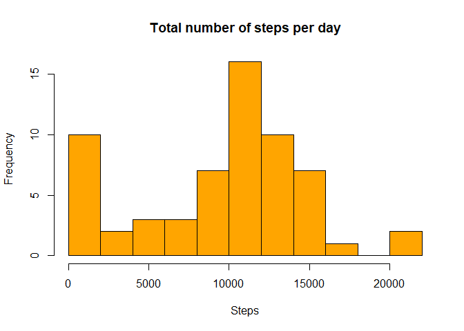
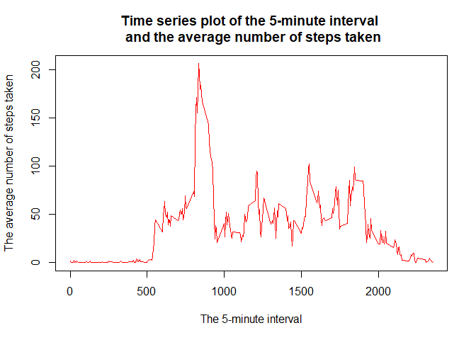
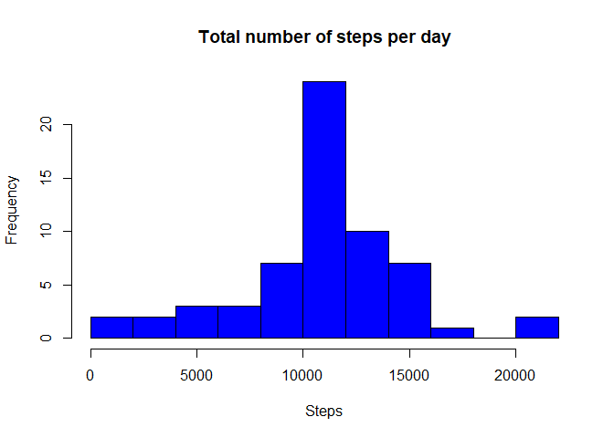
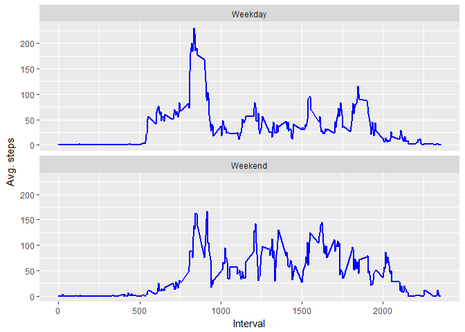

## Loading and preprocessing the data


```r
library(tidyverse)
```

```
## Warning: package 'tidyverse' was built under R version 3.4.3
```

```
## -- Attaching packages ----------------------------------------------------------------- tidyverse 1.2.1 --
```

```
## v ggplot2 2.2.1     v purrr   0.2.4
## v tibble  1.4.2     v dplyr   0.7.4
## v tidyr   0.8.0     v stringr 1.2.0
## v readr   1.1.1     v forcats 0.2.0
```

```
## Warning: package 'tibble' was built under R version 3.4.3
```

```
## Warning: package 'tidyr' was built under R version 3.4.3
```

```
## Warning: package 'readr' was built under R version 3.4.2
```

```
## Warning: package 'purrr' was built under R version 3.4.3
```

```
## Warning: package 'dplyr' was built under R version 3.4.3
```

```
## Warning: package 'forcats' was built under R version 3.4.2
```

```
## -- Conflicts -------------------------------------------------------------------- tidyverse_conflicts() --
## x dplyr::filter() masks stats::filter()
## x dplyr::lag()    masks stats::lag()
```

```r
df_activity <- read.csv("activity.csv", header = TRUE, sep = ",")
```

## What is mean total number of steps taken per day?


```r
df_steps <- df_activity %>% 
        group_by(date) %>% 
        summarize(steps= sum(steps, na.rm = TRUE))

hist(df_steps$steps, breaks=8,main = "Total number of steps per day", xlab = "Steps", col = "orange")
```

<!-- -->

```r
mean(df_steps$steps)
```

```
## [1] 9354.23
```

```r
median(df_steps$steps)
```

```
## [1] 10395
```

## What is the average daily activity pattern?


```r
df_ave <- df_activity %>% 
        group_by(interval) %>% 
        summarize(steps= mean(steps, na.rm = TRUE ))

plot(df_ave$interval,df_ave$steps, 
     type="l", col="red",main="Time series plot of the 5-minute interval \n and the average number of steps taken", 
     xlab = "The 5-minute interval", ylab = "The average number of steps taken")
```

<!-- -->


```r
df_ave[which.max(df_ave$steps), ]$interval
```

```
## [1] 835
```

## Imputing missing values


```r
summary(df_activity)
```

```
##      steps                date          interval     
##  Min.   :  0.00   2012-10-01:  288   Min.   :   0.0  
##  1st Qu.:  0.00   2012-10-02:  288   1st Qu.: 588.8  
##  Median :  0.00   2012-10-03:  288   Median :1177.5  
##  Mean   : 37.38   2012-10-04:  288   Mean   :1177.5  
##  3rd Qu.: 12.00   2012-10-05:  288   3rd Qu.:1766.2  
##  Max.   :806.00   2012-10-06:  288   Max.   :2355.0  
##  NA's   :2304     (Other)   :15840
```

```r
df_activity2 <- df_activity
for (i in 1:nrow(df_activity2))
{
        if (is.na(df_activity2$steps[i])){
                df_activity2$steps[i]<-df_ave[which(df_activity2$interval[i] == df_ave$interval),]$steps
        }
}
summary(df_activity2)
```

```
##      steps                date          interval     
##  Min.   :  0.00   2012-10-01:  288   Min.   :   0.0  
##  1st Qu.:  0.00   2012-10-02:  288   1st Qu.: 588.8  
##  Median :  0.00   2012-10-03:  288   Median :1177.5  
##  Mean   : 37.38   2012-10-04:  288   Mean   :1177.5  
##  3rd Qu.: 27.00   2012-10-05:  288   3rd Qu.:1766.2  
##  Max.   :806.00   2012-10-06:  288   Max.   :2355.0  
##                   (Other)   :15840
```


```r
df_imp <- df_activity2 %>% 
        group_by(date) %>% 
        summarise(steps = sum(steps), na.rm = TRUE)


hist(df_imp$steps, breaks=8,main = "Total number of steps per day", xlab = "Steps", col = "blue")
```

<!-- -->

## Are there differences in activity patterns between weekdays and weekends?


```r
df_activity2$date <- as.Date(df_activity2$date)
df_activity3 <- df_activity2 %>%
        mutate(day = if_else(weekdays(date) %in% c("lördag", "söndag"),
                             "Weekend",
                             "Weekday")) %>% 
        group_by(interval, day) %>% 
        summarise(steps_mean = mean(steps))


ggplot(df_activity3, aes(interval, steps_mean)) + 
        geom_line(color="blue", size=1) + facet_wrap(~day, nrow=2, ncol=1) +
        labs(x="Interval", y="Avg. steps") 
```

<!-- -->
